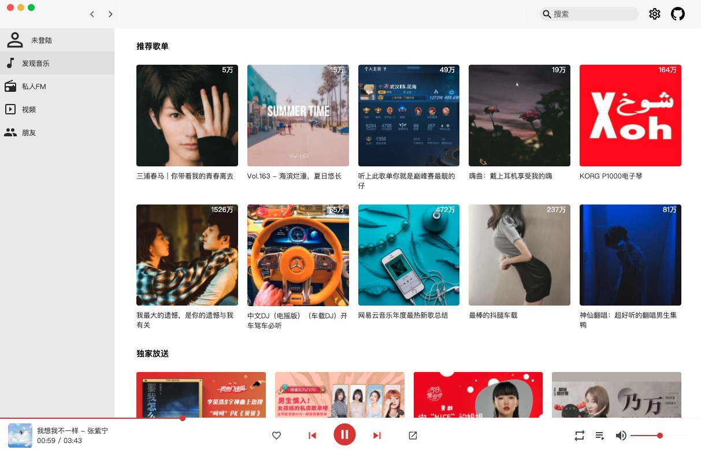

# nete-music

基于 Vue2, vue-router, vuex 全家桶开发的网页版播放器。
网易云音乐后端 API，本项目仅供学习使用。

感谢 [NeteaseCloudMusicApi](https://binaryify.github.io/NeteaseCloudMusicApi) 后端大佬 API 贡献！



```
nete-music
├── LICENSE
├── NeteaseCloudMusicApi
├── README.md
├── docs
└── frontend
```

## 说明

- NeteaseCloudMusicApi 后端
- frontend 前端

## 技术栈

UI 纯手撸，提升自己对各组件实现原理理解能力！

图标基本使用了 material-icons

- vue2 vuecli 创建
- vue-router
- vuex
- scss
- axios
- xgplayer 西瓜视频出品，真香
- es6

## 使用说明

本地运行需要后端支持。

```bash
# 后端
cd NeteaseCloudMusicApi
npm install
npm start

# 前端
cd frontend
npm install
npm start

```

本地 URL: http://localhost:8080/#/discovery

## 功能

- [x] 最新音乐
- [x] 推荐歌单
- [x] 推荐 MV
- [ ] 推荐电台
- [x] 独家放送
- [x] 筛选 mv
- [ ] 分页显示
- [x] 播放 mv
- [ ] 查看作者信息
- [ ] 私人 fm
- [ ] 歌词播放
- [ ] 用户登陆
- [ ] 搜索功能
